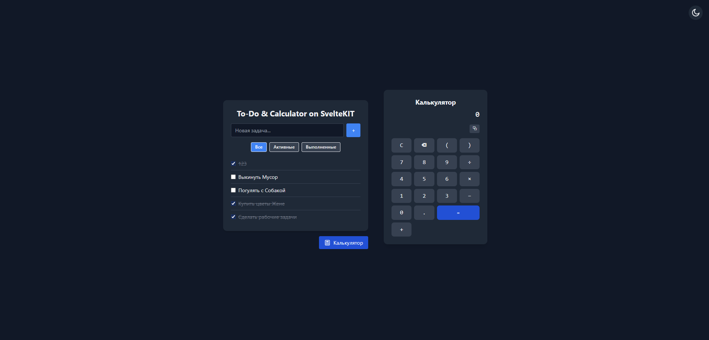

# ToDo & Calculator on SvelteKit



## Описание

Модерновое приложение на SvelteKit 5: удобный ToDo-лист и мощный калькулятор в одном флаконе. Максимально чистый, быстрый, безопасный и типизированный код. Поддержка светлой/тёмной темы, адаптивный дизайн, хранение задач в localStorage, строгая архитектура и покрытие тестами.

## Функционал

- ✏️ ToDo-лист: добавление, удаление, редактирование, фильтрация, сохранение между сессиями
- 🧮 Калькулятор: поддержка скобок, дробей, больших чисел, edge-cases, копирование результата, безопасный парсер (math.js)
- 🌗 Переключение темы (светлая/тёмная, с автосохранением)
- ⚡️ Мгновенный отклик, анимации, современный UI/UX
- 🧪 Покрытие тестами (unit, интеграция, e2e)
- 🛡️ Безопасность: никакого eval, строгая типизация, XSS impossible
- 🏗️ Чистая архитектура, Svelte 5 runes API, TailwindCSS 3

## Установка и запуск

```bash
# Клонируйте репозиторий
 git clone https://github.com/FrankFMY/ToDo-With-Calculator-On-SvelteKIT.git
 cd ToDo-With-Calculator-On-SvelteKIT

# Установите зависимости
 npm install

# Запустите dev-сервер
 npm run dev

# Откройте http://localhost:5173
```

## Сборка и запуск в production

```bash
npm run build
npm run preview
```

## Тесты

- Unit/интеграционные: `npm run test:unit`
- E2E (Playwright): `npm run test:e2e`

> **Внимание:**
> Unit-тесты Svelte-компонентов с runes API (Svelte 5) могут не работать из-за несовместимости tooling (Vitest + @testing-library/svelte). Это ограничение экосистемы, а не кода. Для e2e используйте Playwright.

## Архитектура

- `src/lib/ToDoList.svelte` — ToDo-лист, хранение в localStorage, фильтрация, редактирование
- `src/lib/Calculator.svelte` — калькулятор, парсер math.js, строгая обработка ошибок
- `src/routes/+layout.svelte` — глобальный layout, переключение темы
- `src/routes/+page.svelte` — главная страница, интеграция ToDo и калькулятора
- `src/app.css` — TailwindCSS 3, современный дизайн
- `src/lib/*.spec.ts` — тесты компонентов

## Переменные окружения

- Не требуются для базовой работы.

## CI/CD

- Проект готов к автоматической сборке и деплою (npm, Node.js 22+, SvelteKit 5, Tailwind 3)
- Все зависимости фиксированы, нет мусора и временного кода
- Лицензия: MIT

## Лицензия

[MIT](./LICENSE)

---

**Автор:** FrankFMY

---

> Если у вас есть вопросы, предложения или баг-репорты — создавайте issue или pull request!
